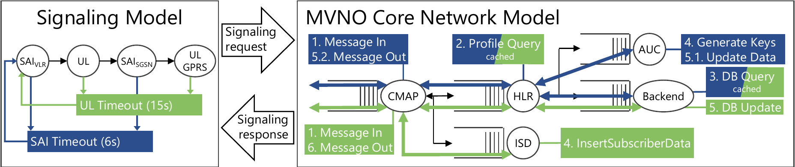

# MVNOCoreSim

This is a simulation of a 3G MVNO virtual mobile core on protocol level including a basic device model as well as detailed interactions of different mobile core components.

This repository accompanies the following publication:

**TODO**



The simulation consists of two distinct models, the device behavior model and the MVNO core model, as shown in the figure above.

Devices aim to complete their attachment cycle consisting of the four depicted signaling messages, while attempting a retry of the timers are triggered.

The core model processes arriving signaling messages and transmits responses to the issuing device.

## Implementation and Structure

The simulation has been developed using the [r-simmer](https://r-simmer.org/) discrete event simulation framework for the R programming language.

To run the example provided in this repository ([run_sim.R](run_sim.R)), the following packages need to be present in the R environment:

- **simmer**
- **tidyverse** -- *Actually only ggplot2, margrittr and dplyr*
- **data.table** -- *For longer running simulation to keep evaluation performant*
- **futile.logger** -- *To provide output of the simulation progress*

```R
install.packages(c("simmer", "tidyverse", "data.table", "futile.logger"))
```
The code is strucuted as follows

```bash
.
├── LICENSE
├── README.md
├── input # Contains the measured processing time samples for each of the code components
│   └── processing_times.csv
├── resources # Contains the overview image and other resources
│   └── sim_schematic.pdf
├── run_sim.R # Main file to run
└── sim # Contains the actual simulation source
    ├── sample_helpers.R # Helper files to sample the processing times
    ├── sim_baseline_recovery.R # Main loops for the different overload control mechanisms
    ├── sim_device_policing_recovery.R # ...
    ├── sim_msu_policing_recovery.R # ...
    ├── sim_simple_dropping_recovery.R # ...
    └── trajectories # Contains the trajectory definitions for each of the different mechanisms
        ├── baseline_recovery
        │   ├── devices.R # Defines how devices behave
        │   ├── helpers.R # Defines helper trajectories
        │   ├── resources.R # Defines component behavior, including processing times
        │   ├── sai.R # Defines trajectories for sendAuthenticationInfo dialogs
        │   ├── sai_unknown_subscriber.R # Currently unused
        │   ├── ul.R # Defines trajectories for updateLocation dialogs
        │   ├── ul_gprs.R # Defines trajectories for updateGprsLocation dialogs
        │   ├── ul_gprs_roaming_not_allowed.R # Currently unused
        │   ├── ul_gprs_unknown_subscriber.R # Currently unused
        │   └── ul_roaming_not_allowed.R # Currently unused
        ├── device_policing_recovery
        │   ├── ...
        ├── msu_policing_recovery
        │   ├── ...
        ├── simple_dropping_recovery
        │   ├── ...
```

## Configuration

The [run_sim.R](run_sim.R) main file includes a preconfigured example simulation using the baseline version without dedicated overload control mechanisms.

The simulation parameters are defined as below.

```R
config <- list(
  n_devices = 50000, # The number of devices to simulate
  init_rate = 300, # The arrival rate of new devices
  runtime = 10, # Max runtime of the simulation - mostly relevant for overload scenarios in which consinuously fail to attach to the system
  policing = list(
    # Parameters for MSU Policing
    sai_vlr = 3000, # Nr. of concurrently allowed dialogs for each of the types
    sai_sgsn = 3000,
    ul = 3000,
    ul_gprs = 3000,
    # Parameters for Device Policing
    n_dev = 3000 # Nr. of concurrently allowed devices to have any dialog in the system
  ),
  capacity = list( # CPU count for each of the core components
    cmap = 8,
    hlr = 64,
    spc = 128,
    auc = 8,
    isd = Inf # ISD is a special "dummy" component representing the external network, therefore Infinite capacity is recommended
  ),
  queue = list( # Queue size of each of the components
    cmap = Inf,
    hlr = Inf,
    spc = Inf,
    auc = Inf,
    isd = Inf
  ),
  retry = list( # Time each device waits before reset and retry in seconds after the respective dialog has been issued
    sai = 6,
    ul = 15,
    ul_gprs = 15
  )
)
```

## Execution and Results

After running [run_sim.R](run_sim.R) using the provided configuration, the output should look as shown here.

```
> source("~/github/MVNOCoreSim/run_sim.R")
INFO [2021-06-09 17:19:00] baseline -- 0 (nDev: 0, unattached: NA, time: 0)
INFO [2021-06-09 17:19:02] baseline -- 0.01 (nDev: 1874, unattached: 40, time: 0.1)
INFO [2021-06-09 17:19:03] baseline -- 0.02 (nDev: 3677, unattached: 48, time: 0.2)
INFO [2021-06-09 17:19:04] baseline -- 0.03 (nDev: 5434, unattached: 41, time: 0.3)
INFO [2021-06-09 17:19:05] baseline -- 0.04 (nDev: 7290, unattached: 38, time: 0.4)
INFO [2021-06-09 17:19:07] baseline -- 0.05 (nDev: 9090, unattached: 47, time: 0.5)
INFO [2021-06-09 17:19:08] baseline -- 0.06 (nDev: 10928, unattached: 51, time: 0.6)
INFO [2021-06-09 17:19:10] baseline -- 0.07 (nDev: 12726, unattached: 46, time: 0.7)
INFO [2021-06-09 17:19:12] baseline -- 0.08 (nDev: 14543, unattached: 46, time: 0.8)
INFO [2021-06-09 17:19:13] baseline -- 0.09 (nDev: 16366, unattached: 43, time: 0.9)
INFO [2021-06-09 17:19:15] baseline -- 0.1 (nDev: 18146, unattached: 35, time: 1)
...
INFO [2021-06-09 17:19:58] baseline -- 0.98 (nDev: 50000, unattached: 0, time: 2.79)
INFO [2021-06-09 17:19:58] baseline -- 0.99 (nDev: 50000, unattached: 0, time: 2.79)
INFO [2021-06-09 17:19:58] baseline -- 1 (nDev: 50000, unattached: 0, time: 2.79)
```

Here, *baseline* describes the name of the currently running simulation, which also dictated the folder in which the results are going to be stored. In this case, results are ending up in `./data/baseline/`.

Next, the output shows the percentage progress towards completion based on the configured `runtime`. `nDev` shows the number of generated devices, `unattached` shows the number of generated devices that have not yet completed their attachment cycle. `time` provides the passed simulation time in minutes.

The simulation creates five output files in the `./data/baseline/` folder.

**arrivals.csv.gz** contains a ledger of each signaling dialog and when it was processed by which component. The format is default to `r-simmer` and well documented there.

**arrivals_global.csv.gz** contains a ledger of all arrivals, including devices with their start and end time.

**attributes.csv.gz** contains the attributes of both devices and signaling messages as well as global attributes that keep track of the general simulation state. The structure is once again common to `r-simmer`.

**resources.csv.gz** contains a ledger of the available resources, their queue sizes as well as occupied CPUs during the simulation time.

**config.csv** contains a description of the input configuration for later referencing.

## Contact

For questions or issues with the simulation, please raise an issue or contact 
Stefan Geissler (stefan.geissler@informatik.uni-wuerzburg.de) or any of the authors of the related publication.

